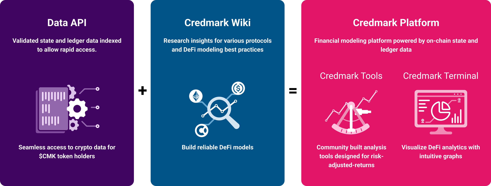

# The Credmark Wiki

Credmark is a financial modeling platform powered by reliable on-chain data. Validated models are readily composable making rapid app development simple.

The Credmark ecosystem is built upon three pillars, the Data API, the Credmark Wiki, and the Credmark Platform.

The Credmark Wiki is community-curated research on DeFi, tokens, and protocols as well as best practices for financial modeling in DeFi, without the expectation to ever be fully complete.

It is divided into three major sections:

* CONTRIBUTIONS,
* DEFI 101, and&#x20;
* FINANCIAL MODELING.

The **CONTRIBUTIONS** section contains the [**Latest Edits**](contributions-to-the-wiki/latest-edits.md) to the Wiki as well as some general information for Contributors [**why**](contributions-to-the-wiki/why-should-i-contribute-to-the-credmark-wiki.md) and [**how**](contributions-to-the-wiki/how-can-i-contribute-to-the-credmark-wiki.md) to to add knowledge to this space.

In the **DEFI 101** section, we describe [**Tokens and DeFi Protocols**](https://app.gitbook.com/o/-MaWsKysgImxTlCSGQdb/s/VkPeP3yOlpUfIWomzh0j/), categorize them, and list specific [**risks**](https://app.gitbook.com/o/-MaWsKysgImxTlCSGQdb/s/s6BiHG0F3kdXOluGl850/) associated with their use.

Within the **FINANCIAL MODELING** section, we explain various [**risk**](https://app.gitbook.com/o/-MaWsKysgImxTlCSGQdb/s/CvSzFXd9R0tD7I4nw1KM/) and [**investment**](https://app.gitbook.com/o/-MaWsKysgImxTlCSGQdb/s/pczHWX0UGGqzFp8kPqLN/) metrics and how they can be measured and applied. We also describe the necessary underlying [**data**](https://app.gitbook.com/o/-MaWsKysgImxTlCSGQdb/s/PkIYLAd7asl8YagulCFT/) that is required for modeling.
