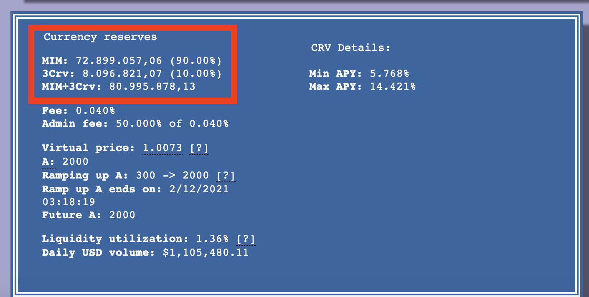

# VaR of Liquidity Providing to Uniswap V2 and V3

## **Executive Summary**

This report is an application of the Value at Risk (VaR) model to Liquidity providing (LP) at Uniswap V2 and V3 platforms. [VaR](https://docs.credmark.com/credmark-risk-library/risk-tools/value-at-risk-var) is a statistical measure to calculate the maximum potential loss covered by market movement. It is a standard tool used in investment banking and traditional finance. Credmark has adapted VaR to measure market risk when providing liquidity on Decentralized Exchanges.

The current Beta version of VaR can be used to monitor the risk of financial exposure when providing liquidity to a particular pool in a DEX. Especially relevant to treasury management applications, our VaR score can be used to ensure positions stay within an organization’s risk appetite. &#x20;

Credmark’s assessment indicates that Uniswap V3 holds more market risk than V2. The market risk in Uniswap V2 is comparable to HODLing tokens, while the narrow price ranges (“concentrated liquidity”) available in Uniswap V3 can create higher potential losses. This assessment did not take into account any fees that might be earned from LP and gas costs.&#x20;

## **Methodology**

Credmark’s Value at Risk (VaR) metric uses a historical simulation model based on the past year of market activity. We apply the 99th-percentile worst-case scenario for a 10-day holding period that is consistent with Traditional Finance (TradFi) market risk capital modelling.

Decentralized exchanges might generate more loss than simply holding assets in a market because they act as automated market-makers. Market makers hold paired assets in a pool; as the market moves, the higher value asset is sold to buy more of the lower-valued asset. This type of downside is called impermanent loss \[1] and is added to the standard HODLing strategy profit or loss.

We’ve illustrated the application of the loss valuing techniques for Uniswap V2 and Uniswap V3 protocols as of 31 December 2021. Based on these run results, as expected, Uniswap V3 showed a significantly higher level of risk compared to Uniswap V2. The narrower the liquidity range, the higher VaR. While the narrower range also entails a higher opportunity to earn money via fees, this is not included in our assessment. The position is assumed to remain the same.

### Uniswap V2 Protocol

Uniswap impermanent loss (IL) function is defined as:

.png>)

, where k =1+r and r is the relative change in price \[1]. In our case 10 calendar days changes since crypto market operates 24/7. Graphically IL equality could be shown as:

![Uniswap v2 Impermanent Loss Function - Losses to Liquidity Providers due to Price Variation on top in Excess to Holding the Original Funds Supplied \[1\]](<../../../../.gitbook/assets/image (2).png>)

Let’s assume we have a balance of $100,000 in BTC/ETH pool distributed evenly as of 31 December 2021. Hence, we’re contributing $50,000 worth of BTC (1.06 units) and $50,000 worth of ETH (13.46 units). Based on last year’s returns, the 99th percentile, 10-day overlapping sampling, and 10-day holding period, we get the following results:

| **Strategy**     |   **HODL**  | **LP (based on total portfolio return)** | 
<strong>LP (based on</strong>

 <strong>IL)</strong>
 |
| ---------------- | :---------: | :--------------------------------------: | :--------------------------------------------------------------: |
| Observation Date | 22 May 2021 |                22 May 2021               |                            4 May 2021                            |
| VaR              |   $49,105   |                  $49,515                 |                             -$17,856                             |
| Impermanent Loss |      0      |                   $410                   |                              $1,552                              |
| Unrealized Loss  |   $49,105   |                  $49,105                 |                             -$19,688                             |

* In the case of LP strategy to Uniswap v2, the impact of IL for the worst-case scenario is minimal and the worst-case scenario is the same as in the case for HODL strategy.
* The 99th worst-case IL is equal to $1,552 and is associated with an unrealized gain during the same period. Note that negative loss is a profit.

### Uniswap V3 Protocol

In the case of Uniswap V3, in contrast to V2, IL is also driven by the LP price range and initial price of the deal, which for our calculations is assumed to be the price at the reporting date. The function defining IL is then defined as:

, where pa and pb are the lower and the higher bound of the set liquidity providing (LP) price range \[2], and _P_ is the current price of the associated pair. Since IL formula doesn’t consider quantity equilibrium implied in the LP position \[3], this is out of scope for the current calculation.

Based on the same parameters:

|                    |                                      |
| ------------------ | -----------------------------------: |
| **Reporting Date** |                        **31-Dec-21** |
| **LP Pool**        |                          **BTC/ETH** |
| **Position in $**  |                          **100,000** |
| **Price**          |                            **12.70** |

The VaR estimates for different price ranges are:

.png>)

Note that the range with the lower bound equal to 0 and high upper bound (x10) price corresponds to the Uniswap V2 that doesn’t have any LP range setting option.

## **Conclusion**

Uniswap V2 does not introduce significant additional market risk to HODLing while Uniswap V3 can introduce impermanent loss exceeding 40% of the notional. However, inthe  case of VaR the primary driver is Unrealized loss from HODLing position hence observation date remains the same for most of the wider ranges.

It is assumed that no fees are received from Liquidity Providing (LPing) in both cases. Uniswap V3 does have the potential to amplify fees earned by providing concentrated liquidity (not covered in this report), but Credmark’s suggestion is not to provide liquidity without a deep understanding of Uniswap V3 and specialized tools.

## Contributors

| Discord Handle    | ETH Address                                    | Reward | Contribution |
| ----------------- | ---------------------------------------------- | ------ | ------------ |
| **atulemis#0983** | **0x5fb7584838fB467e90bb8a1df3a278482e34E856** | 0      | Created      |

## **References**

1. Uniswap V2 - Understanding Returns, Uniswap.org (Accessed on 17 November 2021), [https://docs.uniswap.org/protocol/V2/concepts/advanced-topics/understanding-returns](https://docs.uniswap.org/protocol/V2/concepts/advanced-topics/understanding-returns)
2. Impermanent Loss in Uniswap V3, Auditless (Accessed on 17 November 2021), [https://medium.com/auditless/how-to-calculate-impermanent-loss-full-derivation-803e8b2497b7](https://medium.com/auditless/how-to-calculate-impermanent-loss-full-derivation-803e8b2497b7)&#x20;
3. Atis Elts, 30 September 2021 (Accessed on 1 February 2022), [http://atiselsts.github.io/pdfs/uniswap-v3-liquidity-math.pdf](http://atiselsts.github.io/pdfs/uniswap-v3-liquidity-math.pdf)
