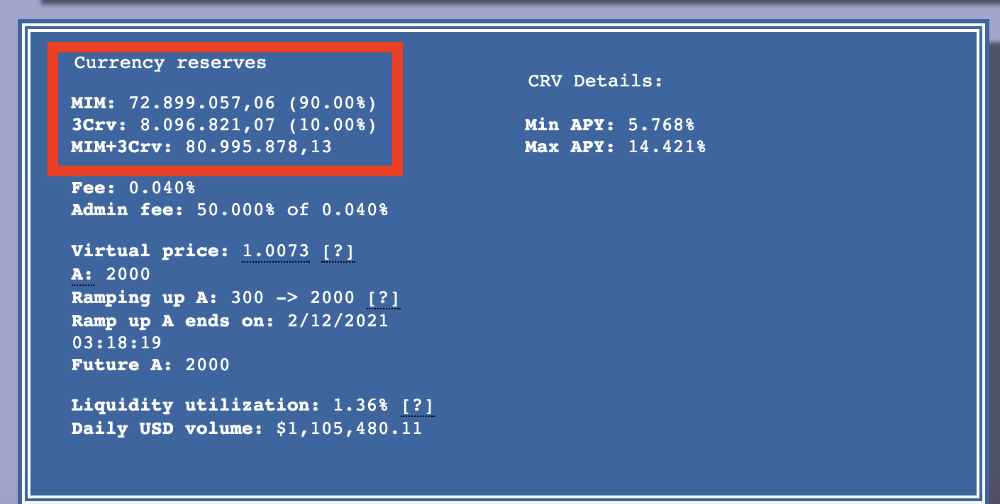

# Terra’s UST post-mortem, risk and treasury management

## Summary

Last week, the biggest and most popular algorithmic stable coin UST de-pegged from USD 1 by 33% in one day followed by a death-spiral sell-off and now it’s trading below $0.1 after slightly more than a week. Its governing token, LUNA crashed by nearly 100% and subsequently was delisted from many exchanges, including FTX and Binance. It’s important to understand how this happened, backed with data and the application of quantitative methods.

## 1. General Information

Algorithmic stablecoins are, in simple words, an automated central bank that, via built-in smart contracts, tries to control the supply and demand of the token so that its price is traded within the required range (peg).

Terra’s UST was by far the largest algorithmic stablecoin ($29 bln. market cap on 5 May 2022) before its crash. It was running a so-called seigniorage model, without fixed collateral, where the peg relied on the arbitrage between UST and Terra’s native token LUNA. The price of the LUNA token reflects the development of the underlying ecosystem and applications, which includes the mining network.

The design of Terra’s stablecoin UST was relatively simple, 1 unit of UST was backed by $1 dollar worth of LUNA, the governance token of Terra. Whenever someone exchanges 1USD for 1 UST, $1 dollar worth of LUNA was burnt. 1 UST can be then swapped anytime to $1 worth of LUNA. When UST is priced over the pegged of $1 dollar, one can mint 1 UST by burning LUNA and sell UST on the open market, and increase the supply of UST to bring it back to the peg. When UST is below the peg, one can mint $1 of LUNA by burning 1 UST and selling LUNA on the open market, and decrease the supply of UST.

There were many algorithmic stablecoins launched in the history of cryptocurrencies \[1], but only sUSD, UST, and FRAX managed to maintain the peg of $1. DAI is conceptually different as it’s fully backed by third-party assets and is a decentralized stablecoin.

The following table provides a breakdown of the size characteristics of UST, FRAX, and sUSD in $ bln as of 5 May 2022.

| Algorithmic stablecoin / Governance token | Liabilities\*, in $ bln | Reserves, in $ bln |
| ----------------------------------------- | ----------------------- | ------------------ |
| UST / LUNA                                | 18.67                   | 3.29\*\*           |
| FRAX / FXS                                | 2.62                    | 2.27\*\*           |
| sUSD / SNX                                | 0.11                    | Undisclosed        |

_\*Given each algo stablecoin is designed to maintain the peg to $1, the market cap of the stablecoin is considered to be a liability from an issuing platform perspective_

_\*\* Self-reported, the information couldn’t have been verified by the third parties \[2], \[3]_

The first UST de-peg happened on 7 May and resulted in the drop of LUNA’s token price and subsequently dropped l to ground zero by 13 May. The table below outlines the impact on the stablecoins market cap at the time before the crash and in the end in $ bln. As we can see, although circulation of non-UST algorithmic stablecoins decreased, they maintained the peg and their market cap remained relatively stable compared to the 92% ($17.23 bln.) drop in UST.

| Algorithmic stablecoin | 5 May 2022 | 16 May 2022 | Diff     |
| ---------------------- | ---------- | ----------- | -------- |
| UST                    | 18.67      | 1.44        |  - 17.23 |
| FRAX                   | 2.62       | 1.49        | - 1.13   |
| sUSD                   | 0.11       | 0.09        | - 0.02   |

Hierarchy chart below outlines the biggest parts of the Terra ecosystem as of 5 May 2022. The arrows represent the direction of claims in case of withdrawal.

.png>)

Here’s a breakdown of primary DeFi operators in UST and their holdings (Wrapped and Wormhole version in Eth main network).

| **Platform Holdings in $ bln**              | **5 May 2022** | **16 May 2022** |   **Diff** |
| ------------------------------------------- | -------------: | --------------: | ---------: |
| **Anchor**                                  |      **14.05** |        **0.26** | **-13.79** |
| Deposits (Terra chain)                      |          16.95 |            0.27 |            |
| Deposits (Avax chain)                       |           0.21 |            0.00 |            |
| Loans (Terra chain)                         |           3.10 |            0.01 |            |
| **Curve** (UST balance / UST % in the pool) |       **0.66** |        **0.02** |  **-0.64** |
| Wormhole UST-3Crv                           |  0.64 / 51.73% |   0.01 / 99.06% |            |
| UST-MIM                                     |  0.01 / 17.89% |   0.01 / 99.54% |            |
| UST-3Pool                                   |  0.01 / 49.63% |   0.00 / 99.02% |            |
| UST-4Pool                                   |  0.00 / 27.94% |   0.00 / 93.97% |            |
| **Sushiswap**                               |       **0.01** |        **0.00** |  **-0.01** |
| **Other**                                   |       **3.95** |        **1.34** |  **-2.61** |
| **Total**                                   |      **18.67** |        **1.62** | **-17.05** |

Anchor is a lending protocol specializing in UST. It was known for its staking program which paid out 20% APY on deposited UST. The total deposits accounted for 75% of the total UST in circulation and paid approximately $0.23 bln. in monthly interest. There has been a large outflow of UST from Anchor (14bln UST before the crash and 1bln UST now). In the initial de-pegging of UST, holders were willing to sell UST at a 10% discount as they have cashed in the interests in the past months. The sale may have replenished the supply of UST in the pool and could have contributed to the further de-pegging of UST.

## 2. Capital-at-Risk

As UST leverages the capital which backs LUNA, it’s critical to assess whether the protocol is well-capitalized to ensure survivability under a stressed situation. In this regard, there are two risk management questions to answer:

* What should have been the required capital-at-risk?
* How was UST positioned against other algo stablecoins before the attack?

### 2.1. How much was needed to break the peg?

During the initial wave of withdrawals, on 10 May the UST dropped to 0.67 cents. This is a de-peg of 33% from the $1 set by Terra.

To model the amount required to break the peg by this much, we can use an Automated Market Maker (AMM) Decentralized Exchange (DEX), where the pricing is algorithmic.

Let’s assume for simplicity that it was a Uniswap v2 UST/DAI pool. The pricing, in this case, is governed by:

$$
x*y=k
$$

Where x and y are the quantities of UST and DAI, respectively, in the pool, and k is the constant number. We assume that both quantities are equal to $19 bln. worth. That is equivalent to the market cap of UST before de-pegging.

With the pricing algorithm, we can estimate that it would take approximately $3.4 bln. of DAI swapped against UST from the pool to move UST/DAI price from 1 to 0.67.

This is larger than the $3.29 bln. that LFG had, which might explain why UST only rebounded to 0.94 for the rest of the day before it crashed.

### **2.2.**  Liquidity Coverage Ratio

Liquidity coverage ratio (LCR) for algo stablecoins is recommended to be parameterized as:

.png>)

, where:\
Stressed liquidity buffer assumes a 30% reduction in its market value, and

Net outflows assuming the need to repay 25% of coins that could be exchanged to fiat within a 30-day window.

With the described approach we could compare UST and FRAX on 5 May 2022, 2 days before the beginning of the UST de-peg:

| **Parameter**                 | **UST**                | **FRAX**               |
| ----------------------------- | ---------------------- | ---------------------- |
| Stressed Liquidity Buffer (1) | 3.29 \* (1-0.3) = 2.30 | 2.23 \* (1-0.3) = 1.56 |
| Net Outflow (2)               | 18.67 \* 25% = 4.67    | 2.62 \* 25% = 0.66     |
| **LCR (1)/(2)**               | **0.49**               |  **2.38**              |

&#x20;As shown, UST was well under-reserved. Its LCR was at 0.49 compared to 2.38 at FRAX.

_**Recommended level of LCR is at least 1.1 which means UST should have had a minimum liquidity buffer of more than double or two times fewer on-demand liabilities.**_

### 2.3. Market Risk Capital

Since market volatility in cryptocurrencies is significant, market risk capitalization is one of the primary considerations.

As mentioned in section 1, Terra had a separate organization tasked with forming a reserve to support Terra Luna in fulfilling its obligations, LUNA Foundation Guard (LFG). Based on what the LFG disclosed on Twitter, as of Saturday, May 7, 2022, the LUNA Foundation Guard held a reserve consisting of the following assets: 80,394 $BTC, 39,914 $BNB, 26,281,671 USDT, 23,555,590 USDC, 1,937,554 AVAX, 697,344 UST, and 1,691,261 LUNA.  for its treasury as of May 7, 2022, before it started to sell in an attempt to pull UST back to pegging, we calculate its VaR (180 days horizon, 10-day return, 99% confidence).

| Day        | Portfolio Value ($bln) | VaR ($bln) | BTC Price  |
| ---------- | ---------------------- | ---------- | ---------- |
| 04/05/2022 | 3.39                   | 0.57       | 39,672.82  |
| 05/05/2022 | 3.12                   | 0.52       | 36,562.70  |
| 06/05/2022 | 3.07                   | 0.52       | 36,039.75  |
| 07/05/2022 | 3.03                   | 0.51       | 35,533.52  |
| 08/05/2022 | 2.90                   | 0.49       | 33,974.54  |
| 09/05/2022 | 2.58                   | 0.44       | 30,334.90  |
| 10/05/2022 | 2.64                   | 0.46       | 30,994.14  |
| 11/05/2022 | 2.45                   | 0.46       | 28,927.18  |
| 12/05/2022 | 2.46                   | 0.51       | 29,124.34  |
| 13/05/2022 | 2.47                   | 0.54       | 29,241.30  |

&#x20;As of 5 May 2022 VaR was $0.52 bln. and represented 17% of LFG reserve. VaR remained stable around the $0.5 bln. mark and didn’t increase, which could mean that the volatility observed over the period between the beginning and end of the crash was in line with Business-as-usual volatility observed in BTC, the largest part of the LFG reserves.

FRAX runs a much more conservative model with 85% of FRAX circulation stored in USDC as collateral and 36.6m$ in various altcoins with the same 10day VaR equaling 0.

As of 5 May 2022 required market risk capital in $ bln. per protocol are:

| Token                                                 |  UST | FRAX |
| ----------------------------------------------------- | ---: | ---: |
| Reserves (1)                                          | 3.29 | 2.27 |
| Required market risk capital (2)                      | 0.52 |    0 |
| 
Risk-adjusted reserves (3) = (1) - (2)
      | 2.77 | 2.27 |
| Risk-adjusted collateral ratio (4) = (3) / Market Cap | 0.15 | 0.87 |

&#x20;Market risk capital should have been set aside to cover the risk of market volatility.

## 3. Treasury Management

Terra UST had flaws in their treasury (assets and liabilities) management:&#x20;

* Community relationships - high concentration of investors and lenders in decentralized protocol
* Product - all liabilities were effectively on-demand without any term structure making it an easy target for a bank run&#x20;
* Tokenomics - a system of incentivization was relying on the assumption of growth and neglected other instruments such as UST staking APY that could have disincentivized sell-off

### 3.1. The concentration of investors and lenders

Was it an attack from one concentrated holder? Yes, it was, we’ve identified significant withdrawals from Anchor made by individual wallets starting from 7 May to 11 May, with the largest made on 8 May that was $347 mln. worth of UST. Pie charts below clearly show this type of behaviour and overall UST inflow was toppled by UST outflow.

UST Liquidity added/removed (deposit and redeems) to Anchor protocol From 5 May - 12 May:

Interestingly, the Top 10 addresses were responsible for around 30% of overall UST liquidity removed during the period, which is very high considering best practice concentration shouldn't exceed 5% per counterparty. The daily break-down of redeeming for the top 10 addresses is below:

Here are stats of the total deposited and redeemed UST in Anchor during 5-12 May.

| **Date**   | **Total Daily UST Redeem (Terra Chain)** | **Total Daily UST Deposit (Terra Chain)** | **Net daily Outflow (Redeem-Deposit)** |
| ---------- | ---------------------------------------: | ----------------------------------------: | -------------------------------------: |
| 12/05/2022 |                                   925.6M |                                    272.0M |                                 653.6M |
| 11/05/2022 |                                  2896.9M |                                    315.3M |                                2581.6M |
| 10/05/2022 |                                  1058.5M |                                    178.4M |                                 880.2M |
| 9/05/2022  |                                  2101.2M |                                    466.3M |                                1634.9M |
| 8/05/2022  |                                  1915.8M |                                    390.1M |                                1525.6M |
| 7/05/2022  |                                  1717.7M |                                    454.0M |                                1263.6M |
| 6/05/2022  |                                   313.1M |                                    331.8M |                                 -18.7M |
| 5/05/2022  |                                   432.3M |                                    460.6M |                                 -28.3M |
| **Total**  |                             **11361.0M** |                               **2868.5M** |                            **8492.5M** |

In summary there were $8.5 bln. net outflows between 5 and 12 May from Anchor.

**Daily Snapshots**

5 May

8 May

.png>)

11 May

.png>)

&#x20;12 May

.png>)

&#x20;Analysis of transactions from the Terra chain confirms that during the first wave of redemptions there was an outflow from a concentrated number of UST depositors equal to 2.5 bln representing 18% of the entire balance and 30% of the whole withdrawal over the week from 5 May. The holders concentration level of more than 5% is considered to be very large. It should have been better managed by Anchor treasury management team through diversification or restructuring.

Also since Anchor had only one staking product which was on-demand, in other words, depositors had the right to withdraw at any time. The term stacking should have been introduced to spread out cash outflows.

### 3.2. Tokenomics

Anchor as the biggest lending protocol played a significant role in Terra UST incentivization mechanism. The rate that was offered to lenders was kept constant at 20%.

Firstly, the rate offered was unsustainable given the size and concentration ($17bln), staking could have been diversified at smaller APYs across different platforms organically. Terra had to find investment opportunities with higher APY to maintain a positive margin.

Secondly, in an unprecedented bank run, the rate of borrowing remained static. Whereas it could have been used as a tool to incentivize inflows and maintain the peg. In particular, introducing a variable rate that would change dynamically tosupport the peg algorithm. Or introducing term structures to incentivize stickier behaviour.

### 3.3. Liquidity Crisis Management

From the lagged nature of actions (the chain was not halted until11 May after 4 days of sell-off). It appears the Contingency Funding Plan lacked robustness and authority to act. This is a typical reason for failures in TradFi institutions before the global financial crisis.

One particular one that is worth mentioning is the ability to timely shutdown technology that might have a flaw that can lead to liquidity crises.

## Conclusion

Data and financial modeling help to extract rational insights on DeFi protocols. Our analysis shows that both risk and treasury management activities required improvements.

Counterparty and maturity concentration thresholds weren’t properly managed. Incentivization tooling was sub-optimal and lacked a variety of tools. The asset and liability management function lacked robust liquidity crisis management expertise and authority.

UST was a high liquidity risk model proven by LCR metrics. LFG should have had separate capital to cover for potential market risk events given its reserves were placed in risky assets. Risk metrics should have been better aligned with peers.

## References

1. Coingecko, How to DeFi: Advanced,\
   https://www.coingecko.com
2. LFG, accessed on 16 May 2022,\
   https://datastudio.google.com/u/0/reporting/b31cc9e5-c54c-4418-a6ce-b332c57e82e9/page/4YBqC?s=or-T7NeGLew
3. FRAX dashboard, accessed on 16 May 2022,\
   https://app.frax.finance/amos
4. LFG Twitter account, accessed on 16 May 2022,\
   https://twitter.com/LFG\_org/status/1526126703046582272\
   \
