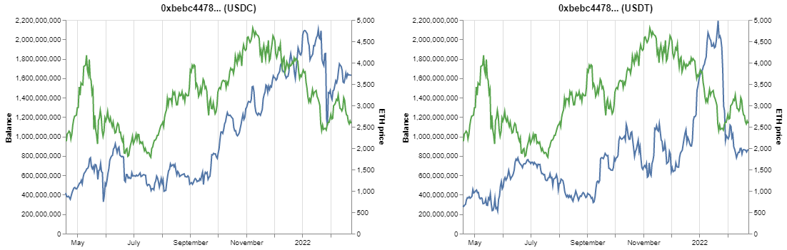
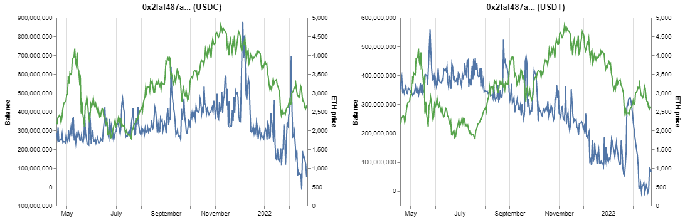

# Account level data for USDC and USDT

## Executive Summary

* From the study of top 100 holders for USDT and USDC respectively, we have a few findings and this opens new ground for further work
* They have high level of concentration (top 100 holders hold 56% for USDC, 23% for USDT). Among them, 30 are cross holders in both (26% in USDC and 11% in USDT)
* The account activity can be divided into two groups based on transaction vs active days:&#x20;
  * &#x20;1-2 per active day or&#x20;
  * \>3 every day
* Historical change of balance can derive cashflow and calculates various cash flow ration like LCR to measure the health and risk.
* Behavior study of transaction pattern, transaction accounts, etc. are new grounds to be explored.

## Introduction

The stablecoin is a fundamental block of DeFi that preserve the value of risky tokens and serves liquid cash for payments and investment. Tracking the movement of stablecoins (though it has no  difference to track another ERC-20 tokens) is of particular meaning as a working capital for liquidity risk (cash flow ratios like [Broken link](broken-reference "mention")) and market risk. USDC and USDT are picked as they are the two most held (\[1], \[2]). Here we would like to share our findings.

## Technical

As both USDC and USDT are both ERC20 tokens, the fetching of the balance and its change can be implemented with web3 API.&#x20;

* Current balance: this can be called with BalanceOf with a block number.
* Balance history: there are two ways to do it:
  * Use `get_logs` to retrieve logs from the interest range of blocks. Loop over to identify the transactions for USDC and USDT tokens and recipient/receiver is the account. (Time consuming)
  * Use event log filtering for the contract of USDC and USDT to find logs with Transfer event with the wallet (more effective, used)

We collected historical transactions for the top 100 holders of USDC and USDT obtain from EtherScan on 23rd Feb 2022\[2]. This spans over block number 12261196 to 14260995, mapping to 18th Apr 2021 to 23rd Feb 2022 (312 days).

We use circulation supply in this article.

|  **Source**         |  **USDT**      |  **USDC**      |
| ------------------- | -------------- | -------------- |
|  Circulation Supply | 79,483,506,960 | 53,189,512,355 |
|  Total Supply       | 47,643,566,256 | 39,823,119,844 |

## Analysis

### Assumption

ETH blockchain maintains the anonymity of wallet holder (though some are self-tagged in EtherScan) to the wallet address. For this article, as a simplification, **we assume that there is one holder per wallet so wallet and holder are used inter-changeably.** For another topic, we can apply some forensic techniques to identity the true holders though the pattern of internal transactions.&#x20;

### Holdings

Below table tabulates the sum of balances in the wallets.&#x20;

* There are 30 holders in common between two 100 holders' lists. We call them "cross holders". They hold 26% (USDC) and 11% (USDT) of the circulation supply.&#x20;
* The rest of 70 holders hold 30% (USDC) and 12% (USDT)
* All large holders hold 56% (USDC) and 23% (USDT)
* The alternative holders' ratio is similar to the cross-holders' ratio. It means the other holders (70) hold little of the alternative stablecoins.

The simple takeaway is that USDC is more concentrated held by large holders than USDT.

| Quantity                | USDC                                                                                     |                                                                        |
| ----------------------- | ---------------------------------------------------------------------------------------- | ---------------------------------------------------------------------- |
| Cross holders (30)      | 13,743,537,494 (26%)                                                                     | 8,687,909,260 (11%)                                                    |
| Other holders (70)      | 16,172,936,609 (30%)                                                                     | 9,482,639,046 (12%)                                                    |
| All large holders (100) | 29,921,653,672 (56%)                                                                     | 18,170,548,307 (23%)                                                   |
| The alternative holders | 
In top 100 <strong>USDT</strong> holders <strong></strong>13,985,469,468 (26%)
 | 
In top 100 <strong>USDC</strong> holders 8,687,909,260 (10%)
 |
| Circulation Supply      | 53,189,512,355                                                                           | 79,483,506,960                                                         |

The below chart shows cross-holder's balance in both USDT/USDC, ordered by the sum of amount in both USDT/USDC.

.png>)

### Distribution of Holding

The distribution of holding among the large holders follows Pareto distribution, or commonly known as 80-20 principle. To be precise, the the actual distribution is a bit more balanced than 80-20. Let's look into some details.

Below charts show the distribution of balances in USDT and USDC among the 100 holders. The blue dashed line is the reference line of 80-20 distribution at **b=1.16**.

* The distribution of USDT fits to a Pareto distribution of **b=3.1** (red dashed line) for the first 8 holders.
* The distribution of USDC fits to a Pareto distribuion of **b=1.8** (inclusion of the top #1 holder), and b=3.1 (excluding the top #1 holder).
* Both are more balanced than 80-20, which is a more steeper curve of **b=1.16**. Among the two, USDC is more concentrated. This is aligned with previous analysis showing the high percentage in holding by large holders for USDC.

.png>)

.png>)

### Historical Transactions vs. Active Days

We noticed that, for some wallet, they are not active with only a handful of transactions during the 312-day period. Is there a relationship between the active days and the total number of transactions, meaning an active holder is active transacting?

Hence, we plot the number of active days (having at least one Tx per day) and total number of transactions and run an regression.

To better visualize, we show the figure in the log space of 10. The regression reveals main two category of group by its activity. The **A** group, which scatter around the lower slant dashed line (from regression), shows a fixed frequency of transactions per day during its active dates. The holders of this group are **live for **_**n**_** days for around **_**n**_** number of Tx.** The second **B** group is located at the right-top cornor, all with >1000 transactions (average 3 Tx per day), as high as 1 million transaction during the 312-day period.

We could categorized the **A group** as a **cold holder s**(large balance, seldom changes) or **temporary holder** (parking accounts, funds going in and went out) while the **B group** as **active holders**.

 (1).png>)

### Distribution of Active Days

The distribution of active days show a bi-polar pattern. With more holders with <10 transaction over the 312-day period.

 (1).png>)

### Account balance over time

#### One cross-holder in both USDC and USDT - 0xbebc4478

This wallet is a cross-holder and active holder with 312 active days and about 100k Tx in both USDT and USDC. We can view it's balance changes in below figure in both stablecoins, with backdrop of the ETH price reflecting the DeFi-macro. The movement in USDC is more or less in tandem with ETH price while the USDT balance changes in anti-correlation to the ETH price.

If we take the transaction as cash flow for the holder. The LCR ratio is the current balance of stablecoins divided by the max 30-day cash outflow.

* The largest 30-day cash outflow is 1\_790\_115\_636.
* Current balance is 2\_495\_452\_172
* LCR is 1.39 (meets the requirement of BASEL III)

#### Another cross-holder 0xaf2f

The holder has very active Tx (over 50k for USDT/USDC respectively). The LCR is 0.17 (below the requirement). This reflects the fact of downward-trend of holdings.

#### Large balance change

Below shows two accounts in USDC `0x7758...` and `0xae2d`,  one with continuous cash in-flow and another with a large cash outflow.

&#x20;The LCR for `0x7758` is -27.6 (more than sufficient) and for `0xae2d` is 0.35 (insufficient, below requirement).&#x20;

#### Balance change for inactive accounts

For inactive accounts (active days <300), there are different patterns of change. Their behavior and potential usage could be studied.

## Summary

* The account-level data for stablecoins like USDT/USDC opens lots of new grounds to study the risk, the behavior, the usage, the holders themselves.

## Reference

\[1] [https://coinmarketcap.com/view/stablecoin/](https://coinmarketcap.com/view/stablecoin/)

\[2] USDC [https://etherscan.io/token/0xa0b86991c6218b36c1d19d4a2e9eb0ce3606eb48](https://etherscan.io/token/0xa0b86991c6218b36c1d19d4a2e9eb0ce3606eb48) and USDT [https://etherscan.io/token/0xdac17f958d2ee523a2206206994597c13d831ec7](https://etherscan.io/token/0xdac17f958d2ee523a2206206994597c13d831ec7)

## Contributors 

| Discord Handle | ETH address                                 | Reward          | Contribution     |
| -------------- | ------------------------------------------- | --------------- | ---------------- |
| ​kunlun#8324   | 0x109B3C39d675A2FF16354E116d080B94d238a7c90 | $CMK (internal) | Original version |
